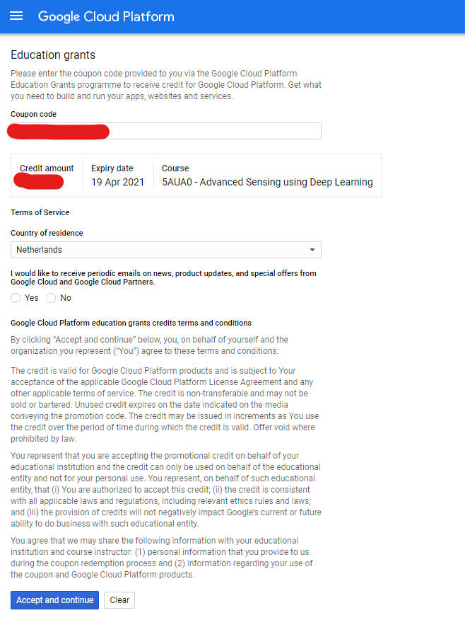

# Google Cloud
After following the instructions from the e-mail you have received to obtain the coupon code, credits for Google Cloud 
can be added in your account through the following steps (image given below).
1. Navigate to [https://console.cloud.google.com/edu](https://console.cloud.google.com/edu)
2. Enter the coupon code (see e-mail)
3. Select your country of residence
4. Opt-in or opt-out of newsletters
5. Accept and continue



## Virtual Machines
The actual computations for training or inference are done using virtual machines that can access Google's compute 
resources. These virtual machines can be set up with a multitude of resources and - depending on the speed/memory of 
them - you pay an hourly rate (calculated per minute the machine is running). Credits will be deducted when a machine is
running, so be careful to remember to turn off machines after use! It is not necessarily worth the extra GPU 
capabilities if the network you want to train does not require those resources, so think critically about the network 
architecture and features to select an appropriate setup (GPU, CPU, and memory).

Specially made for deep learning, there are setups available in the Google Cloud Market Place. In this tutorial we will
describe the use of the Deep Learning VM, which is ready to deploy, optimized for their Intel CPUs, and GPU-ready.

### Set-up
First, navigate to Marketplace in Google Cloud Platform (or access it 
[here](https://console.cloud.google.com/marketplace)). Search for "Deep Learning VM", and select it from the list. 
Alternatively, you can navigate to it directly using 
[this link](https://console.cloud.google.com/marketplace/details/click-to-deploy-images/deeplearning).

Click `Launch on Compute Engine`, and if you see a project selection window, select the project you have created for 
this course.
If this is the first time you've launched Compute Engine, you must wait for the initial API configuration process to 
complete.

If you have not yet expanded your GPU quota (standard is set to 0), you must request a larger quota. This is checked 
automatically, so you don't have to wait long. A red info pane at the top of the page will indicate whether you need
a larger GPU quota:


Click on the link to your 
[quotas page](https://console.cloud.google.com/iam-admin/quotas?metric=GPUs%20(all%20regions)&location=GLOBAL), select 
`Compute Engine API` and click `[+] EDIT QUOTAS` at the top of the page. On the pane that opens, fill in your details 
(phone number need not be accurate), and click next. Enter a new quota limit (e.g. 2 for 2 GPUs to be used 
simultaneously), and enter a description (e.g. 'Needed for a university course in deep learning'), click on done and 
then click submit request. Now, within a couple of minutes, you should receive a confirmation of your request on the 
email address of your account.

Now, back on the tab new Deep Learning VM page, you must enter a `deployment name`. This (appended with `-vm`) will be
the root of the virtual machine. Depending on the GPU that you require, you must select a region where that GPU setup is
available (NVIDIA Tesla K80, P100, T4, V100). You can check out the region-specific details 
[here](https://cloud.google.com/compute/docs/gpus), however to increase the speed/bandwidth while accessing your 
virtual machine, select a region containing `europe-west`.

Then, select the machine type you will need. This describes the number of CPUs and RAM available to your machine. More 
CPUs and RAM will cost more to run, so only increase this if you expect to need those resources.

In the section `GPUs` you can select the type and amount of GPUs available to your virtual machine. Again, the more GPUs
you select and the higher the compute/memory of those, the more expensive your machine will be to run. The effective 
hourly rate is updated on the right of this page after each change you make. If you click `details`, the cost of each 
component of the machine is broken down.

Then, you can select the framework you want to use to run your network on. Practically, this can either be PyTorch or 
TensorFlow, but do have a look if there is a framework you would rather use. This selection will install all the 
required packages and dependencies. 

It is highly recommended to select the `Install NVIDIA GPU driver automatically on first startup` option. This will 
install all the required drivers necessary to use their GPU(s).

Finally, set the persistent disk to a size and type required (training data storage will be discussed later in the 
Google Buckets section). As it is persistent, this instance will not be deleted when the VM is stopped, and you will be
billed for this continuously (indicated in the detailed section of the monthly cost on the right pane). 

Now, all is ready, and the VM can be created by clicking `Deploy`. This will take some time, as it needs to install and 
set up everything. It can take up to 5-10 minutes when you have also indicated that the NVIDIA GPU drivers need to be 
installed.

### Access
To make sure you can connect remotely to your instance (i.e. from your laptop/computer at your home network), make sure
you can access the virtual machines. For this, it must have SSH or RDP access, which requires ports 22 or 3389 to be 
open respectively. These should be enabled by default, but make sure to check the 
[Firewall rules page](https://console.cloud.google.com/networking/firewalls) for rules that allow `tcp:22` and 
`tcp:3389` connections.

It is possible to connect to the instances both through the Google Cloud Console (web page) or the 
[`gcloud` command line tool](https://cloud.google.com/compute/docs/gcloud-compute) in the 
[Cloud SDK](https://cloud.google.com/sdk). Note: if these basic SSH options do not work, you might want to try [third
party tools](https://cloud.google.com/compute/docs/instances/connecting-advanced#thirdpartytools) (e.g. terminal SSH on 
Linux or PuTTY on Windows).

For the Google Cloud Console access, navigate to your 
[VM instances page](https://console.cloud.google.com/compute/instances). Click `SSH` on the machine you want (found in 
the column called Connect). This should open a terminal where you can run any command you like. For a small cheat sheet
of Linux commands, see the last section of this tutorial.

For the other method, using the `gcloud` console, run the following, filling in the project id, zone and instance name
corresponding to your instance:
```
gcloud compute ssh --project [PROJECT_ID] --zone [ZONE] [INSTANCE_NAME]
```

#### Connection VM with Github 
First off: open the virtual machine in google cloud by starting the [VM instances page](https://console.cloud.google.com/compute/instances) and clicking at the `SSH` button. A new black virtual machine window pop ups, which looks like this: 
(./assets/img/vminstance.png)

To connect the virtual machine with your github account or repository a new ssh key needs to be added to your profile/repository. 
The generation of the new ssh key can be done with the usual ssh key generation command line: 
```
ssh-keygen -t rsa -b 4096 -C [github_email]
```
Next there will be asked if you would like to rename the key. This is not needed. You can just press `enter` on your keyboard.
The next question is if you would like to give it a password. This is also not necessary. So you can also just press `enter`.
Now the ssh key is generated for the VM.
Next up you would like that the key is shown in your VM screen. This can be done by giving this command:
```
cat /home/[google_user_name]/.ssh/id_rsa.pub
```
Now your ssh key is shown for the virtual machine. You have to copy this ssh key.
For now we switch to your github account with the copied key. If you are able to deploy this key in this specific repository, you can upload the key at repository settings under 'deploy keys'. If this is not possible for the specific repository. You have to copy the key to your account. This is done at clicking at your avatar in the top right corner of github. Then click 'Settings' --> 'SSH and GPG keys' --> 'New SSH Key' insert the key over here and give it a name. 

Now go back to the black Virtual Machine screen. 
Furthermore the GitHub has to be added to the list of trustfull servers to make sure a SSH connection is possible. This is done by entering this in the command line:
```
ssh-keyscan github.com >> /home/[google_user_name]/.ssh/known_hosts
```

When this is done it is possible to clone your git repository in the virtual machine.  It is optional to clone this in a certain folder. This can be done by adding a foldername behind the command.
```
git clone git@github.com:[user_name]/[repo_name].git
```
Make sure that the code works when running in the virtual machine!
The code can be run in the virtual machine by the command:
```
python [file_name.py]
```

## Data and Google Buckets
Training/evaluation dataset can be efficiently stored in a bucket. This bucket can then be linked to your virtual 
machine instance so that the data can be accessed by it. Use `gsutil` to create and modify these buckets on the command
line.

### Set-up buckets
In your Google Cloud environment, navigate to [Storage](https://console.cloud.google.com/storage/browser). Here, you can
click `[+] CREATE BUCKET` to make a bucket in your project. A bucket name must be globally-unique, and can be 
indexed by everyone, so make sure to not include sensitive information in the name. Enter such a name and click 
continue. Now, for the location of your data, choose `Region`, and select the region you created your VM instance with.
Keep the default storage class as `Standard`. Given the details of the access control options, select the one you 
prefer. In general, `Uniform` should be sufficient for use in this course (this means that if you have access to the 
shared bucket, you have access to all its contents). Leave the advanced settings as is, and click `Create`.

Now, on the page containing your bucket, you could upload files and folders using the buttons. However, it might be 
easier to do this using the command line. For this you would again need Google's Cloud SDK with `gsutil` installed. 
A bucket can also be created using the Google Cloud SDK with `gsutil mb` (make bucket). 
```
gsutil mb -b on -l europe-west4 gs://my-bucket/
```


### Upload data to buckets
Next to the buttons on your Google Cloud Bucket page, files can be uploaded command line in the Cloud SDK using the copy
(`cp`) command:
```
gsutil cp file.ext gs://my-bucket/
```

Similarly, complete folders can be uploaded using the recursive version of that:
```
gsutil cp -r dir gs://my-bucket/
```

You can also manage access through the command line (next to [IAM](https://console.cloud.google.com/iam-admin/iam) in 
Google Cloud):
```
gsutil iam ch user:jane@gmail.com:objectCreator,objectViewer gs://my-bucket/
```


### Mount buckets to VM instances
If you want native file access to your bucket from your VM instance, you can follow [this Google 
tutorial](https://cloud.google.com/storage/docs/gcs-fuse) to set up FUSE. 

&nbsp;

* * *

&nbsp;

## Linux commands cheat sheet

| General                                                                                    |                                      |
|--------------------------------------------------------------------------------------------|--------------------------------------|
| Linux system information                                                                   | `uname -a`                           |
| Show how long it has been running                                                          | `uptime`                             |
| Display and manage the top processes                                                       | `top`                                |

| Files                                                                                      |                                      |
|--------------------------------------------------------------------------------------------|--------------------------------------|
| List all files in a directory                                                              | `ls`                                 |
| Move to a certain directory                                                                | `cd /path/`                          |
| Go up one level of the directory tree (Change into the parent directory)                   | `cd ..`                              |
| Go to the $HOME directory                                                                  | `cd`                                 |
| Make a directory                                                                           | `mkdir directory`                    |
| Remove a file                                                                              | `rm file`                            |
| Remove a directory and all its contents (recursively)                                      | `rm -r directory`                    |
| Copy a folder and all its contents (recursively)                                           | `cp -r source_directory destination` |
| Create an empty file                                                                       | `touch file`                         |
| View the contents of a file                                                                | `cat file`                           |
| Display the first 10 lines of file                                                         | `head file`                          |
| Display the last 10 lines of file                                                          | `tail file`                          |
| Display disk usage for all files and directories in human readable format                  | `du -ah`                             |
| Display total disk usage off the current directory                                         | `du -sh`                             |

| Search                                                                                     |                                      |
|--------------------------------------------------------------------------------------------|--------------------------------------|
| Search for pattern in file                                                                 | `grep pattern file`                  |
| Search recursively for pattern in directory                                                | `grep -r pattern directory`          |
| Find files and directories by name                                                         | `locate name`                        |
| Find files in /home/john that start with "prefix"                                          | `find /home/john -name 'prefix*'`    |
| Find files larger than 100MB in /home                                                      | `find /home -size +100M`             |

| SSH                                                                                        |                                      |
|--------------------------------------------------------------------------------------------|--------------------------------------|
| Connect to host as your local username                                                     | `ssh host`                           |
| Connect to host as user                                                                    | `ssh user@host`                      |
| Connect to host as user using port                                                         | `ssh -p port user@host`              |

| File Transfers                                                                             |                                      |
|--------------------------------------------------------------------------------------------|--------------------------------------|
| Secure copy file.txt to the /tmp folder on server                                          | `scp file.txt server:/tmp`           |
| Copy *.html files from server to the local /tmp folder                                     | `scp server:/var/www/*.html /tmp`    |
| Copy all files and directories recursively from server to the current system's /tmp folder | `scp -r server:/var/www /tmp`        |
| Synchronize /home to /backups/home                                                         | `rsync -a /home /backups/`           |
| Synchronize files/directories between the local and remote system with compression enabled | `rsync -avz /home server:/backups/`  |

